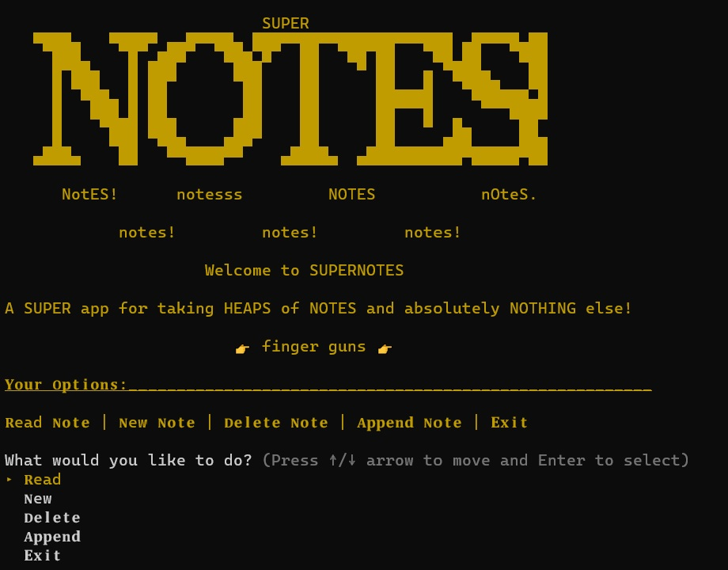

## Assignment 3 - Terminal App - SUPERNOTES

## Link to Repository

[Github - SuperNotes](https://github.com/pepsinprozac88/lukemeredith_T1A3)


## Welcome to SuperNotes!

My application, SuperNotes, is a terminal application designed to take notes, read note, append to notes, and delete those notes if necessary. SuperNotes takes input from a user in the form of a note title and note content, then opens a text file and saves the user's input (the note heading and content) to the text file along with the date which the note was created. The user can also use SuperNotes to look through a list of their created notes, or search for them by name, and either edit the note or delete the note. Basically, SuperNotes is super basic. But it works, and it's super. It will solve all the client's note taking needs; even though there are hundreds of other note-taking apps on the market, you can rest assured that none of them take a note as SUPERbly as SuperNotes! The target audience for this program is anyone who wants to jump in on the fast-paced and always-expanding world of note-taking. From office workers to soccer-mums, if you need to take a note, we got the app for you!

The app is extrememly user friendly; the UI is quite bland (it's a terminal app, after all...), utilizing only the up/down arrow keys to navigate short menus, and simple, clear instructions on every page and before every menu option, making sure the user is never lost or confused as how to use it. 

## Using SuperNotes:

*Note:* SuperNotes is a user-friendly application. All instructions are in-app, spelled out clearly in the terminal window for the user's convenience. 

SuperNotes main page is simply a title screen with the navigation menu below it. Use the up and down arrow keys to navigate the options and press the 'enter' key to select. The main page looks like this:



**User Options:**

***Read*** - This option will list all existing notes and allow you to type in the name of the note you would like to read and press enter. Note that you *can* have spaces in the note title, and you do *not* have to add the .txt file extension at the end of the title; Supernotes automates these processes for you by replacing spaces with underscores ('_') and adding the file extension without the user having to worry!

***New*** - Creates a new note. Follow the instructions on screen. Note that you cannot create a note without a title, or create a note that shares an existing note's title. Your note can also be multi-lined; though pressing the 'enter' key three times without inputting text will end the note and save it to Supernote's **/src** directory in .txt format.

***Delete*** - Use this option to delete an existing notes. Supernotes again gives you a list of all exisiting notes from which you can choose the note you wish to delete by typing in the name of the note (sans the .txt file extension and '_'s). To avoid accidental deletion, the user is asked one last time if they are sure they wish to delete the current file. Note than deleting a note is permanent; deleting notes in-app will also delete the associated .txt file from the 'src' directory.

***Append*** - This feature allows the user to open an exisitng note using the same method as mentioned previously (read a list and tyoe the note name etc.) Once the note is selected, the app prompts the user for additional note text which will be saved *to the end* of the note when the enter key is pressed three times (again allowing multi-lined text to be typed into the command line).

***Exit*** - Closes the Supernotes app, with grace :)


**Exporting notes (or, accessing the files at their source):**

If you wish, you can retrieve the actual text file version of your note for use in other software, editing, printing, etc. The note files are created and stored in Supernote's **/src** directory, in *filename*.txt format. Note that if you remove or delete the file directly from the **/src** directory you will no longer be able to access it from within the Supernotes program.


**Troublshooting:**

For a comprehensive help document, see 'help.txt' in the SuperNotes **/docs** directory. Honestly though, there's not much help needed with the Supernotes app; there are no known errors, and all known user-related errors are addressed in app with instructions as to why the user may have recieved said error. If the app does freeze, the user can use Ctr-Z or Ctr-C to force-close the program, and restart it using the method stated previously. If the issue persists, try uninstalling and reinstalling the program as per the instruction above, or else feel free to contact me with questions or issues through my GitHub page. The link is at the top of the page.


# Software Development 

## FEATURES OF SUPERNOTES

### Command Line Arguments
*(defined in help.rb)*

For CLI help, use the terminal to navigate to the SuperNotes **/src** directory and type the following (without quotation marks): 'ruby supernotes.rb', then a space, before adding one of the following flags:

- '-a'         list all command line arguments
- '-all'       list all command line arguments
- '-h'         help
- '-help'      help
- '-v'         show version information
- '-version'   show version information


### TTY PROMPT arrow-key Menus 
*(defined on line 27 of supernotes.rb)*

Using the ruby gem tty-prompt, Supernote will have a simply UI, utilizing the gem's code in order to add an options menu as a front-page, where the user will be able to choose to read notes, create a new note, delete a note, append an existing note, or else exit the program. The code for the navigation menu is as follows:
```ruby
choose = %w(𝐑ead 𝐍ew 𝐃𝐞𝐥𝐞𝐭𝐞 𝐀𝐩𝐩𝐞𝐧𝐝 𝐄𝐱𝐢𝐭)
choice = prompt.select("What would you like to do?", choose).to_s
```
followed by a `case` statement encompassing the control flow of the program via the options mentioned above.


### Function - Create New Note
*(method defined on line 8 of methods.rb, usage in code block begins on line 31 of supernotes.rb)*

The first and most essential feature of SuperNote is it's ability to create a new note. The program asks for the title and stores it in the variable *filename*. The title can be multiple words and does not need a file extension added as the program does all of this automatically using `filename = gets.chomp.gsub(" ", "_").to_s.downcase + ".txt"`. It also automatically adds the date of the note's creation to the note using the class/method `Date.today`, then lastly prompts for note content, which can be multi-lined (a litle trick using `gets(\n\n\n)`- where user input won't be assigned to it's variable until three new blank lines have first been submitted). Input is *then* stored in the variable *content* i.e. `content = gets(\n\n\n).chomp`. Finally, a text file is created in the local **/src** directory using the following method/class:
```ruby
def create(filename, content) # Creates a new note, saves the note in .txt format to local directory.
   File.open(filename, "w") do |file|     
   file.write(content)
   end
end
```
**Error-handling:** If the note title is already in use or left blank (which uses an if/else statement and the logical operator `File.exists?(filename) == false && filename != ".txt"`) to search the directory), the app will tell the user that the title is either already in-use or invalid, respectively. This is the first instance of error handling in SuperNotes. 


### Function - Read Your Notes
*(**read** method defined on line 1 of methods.rb, usage in code block begins on line 59 of supernotes.rb)*
*(list method, called **instructions**, defined on line 18 of methods.rb, usage in code block begins on lines 60/76/100 of supernotes.rb)*

The second feature is the ability to list and read your notes. Again, the user chooses the option 'Read' from the menu, which lists all available notes with `puts Dir.glob("*.txt")`. The user can then input the name of the note they wish to read - using the same method stated above - which retrieves the note, along with its title and creation date, and prints it all back to the screen. This is accomplished using the method/class/iterator:
```ruby
def read(filename)   # Reads each line of the .txt file back to the terminal screen.
   File.open(filename).each do |text|
   puts text
   end
end
```
**Error-handling:** When inputting the note title, the program uses an if/else statement to determine if the note title exists (using `if File.exists?(filename) == true` #code to read). If the user input does not match an existing note title, the user will recieve an error message stating that the note does not exist (i.e `else` #error message)


### Function - Append Your Notes
*(usage in code begins on line 99 of supernotes.rb)*

The third feature was originally supposed to allow the user to fully edit existing notes in-app. But I couldn't figure out how to accomplish this and instead went with the option to simply add to exisiting notes. Supernote allows the user to append notes under the 'Append' option on the main page. Using the same list and input-to-open methods mention previously, the user is given a list of existing notes and can input the title to 'open' its contents, which can then be appened. The program does this using the following code:
```ruby
   if File.exists?(filename) == true
   #I've removed the UI sprinkles for simplicity's sake
   add_text = gets("\n\n\n").to_s
   File.write(filename, add_text, File.size(filename), mode: 'a')
```
 Note that there is note functional way in SuperNotes to edit or change an exisiting text in a note without first deleting the note and then recreating it. 
 **Error-handling:** Same as above.


### Function - Delete Unwanted Notes
*(usage in code begins on line 75 of supernotes.rb)*

The final feature of SuperNote is the ability to list all existing notes, search by name and delete them from the list. This permanantly deletes the notes (as in, the note is removed from the SuperNotes app *and* its associated text file is deleted from the local directory). Again, the user is given a list of existing notes and is prompted for the title of the note they wish to delete (using the same `filename =` method as outlined previously). If the note exists (using the `File.exists?(filename)` class/method as stated previously), the user is promted one last time using a tty-prompt and another case statement to ask: "Are you sure you want to delete this note?". This is an added safety measure to ensure the user won't accidentally delete the wrong note. When the user chooses "Yes", the note is deleted using the class/method `File.delete(filename)` and the message "Note Deleted" is printed in red text to the screen. Here is the functional code, sans fancy UI stuff:
```ruby
if File.exists?(filename) == true
   choose3 = %w(Yes Cancel)
   choice3 = prompt.select("Are you sure you want to delete this note?", choose3).to_s
   case choice3
      when "Yes"
         File.delete(filename)
         puts pastel.red.bold("\nNote deleted!")
      else "No"
         puts pastel.bright_green.bold("\nCancelled.")
      end
```


### Additional Functions - Exit and 'Rescue'
*(defined on lines 119 and 130 of supernotes.rb, respectively)*

These functions are minor, providing a graceful way to exit the program via the final block of the integral case statement (using a simple `break` method), and a failsafe error message should any of the previous error handling methods fail to catch a disgraceful error, respectively.


## Methods for some of the functions stated above:


## Implementation Plan

### Control flow diagram: 


### Trello Board - project organization

[Trello - Termninal App](https://trello.com/b/3HrFlKW0/supernotes-terminal-app)
